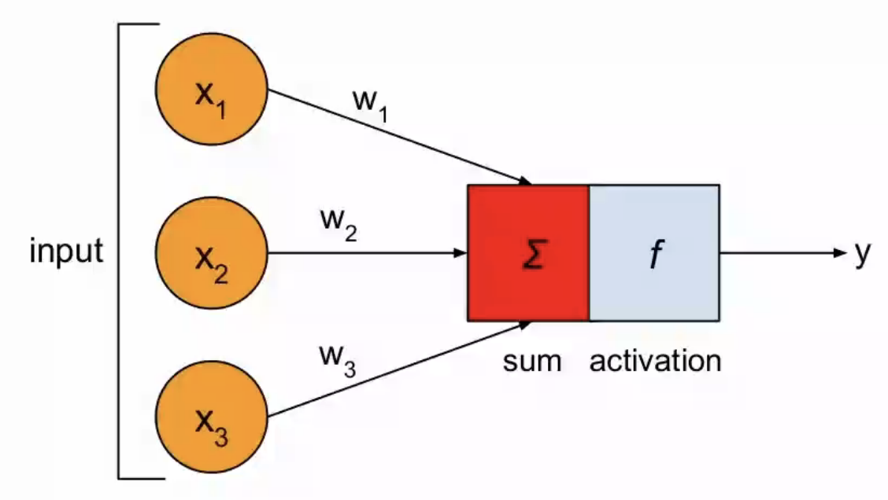
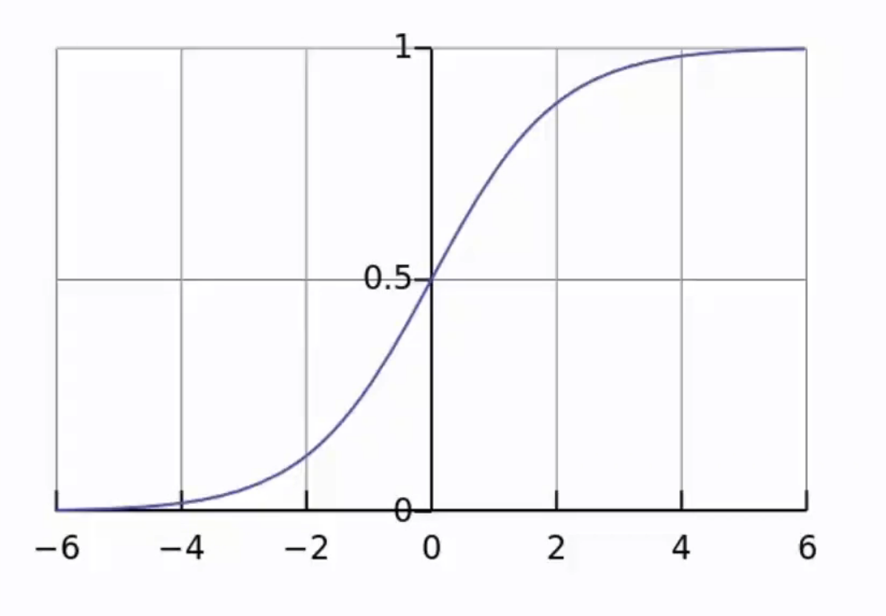

# 构建人工神经元 #

生物神经元
人工神经元背后的数学原理
用Python实现一个人工神经元

## 生物神经元 ##
 树突-细胞体-轴突
 树突：输入模块，获得信号，输入细胞体
 细胞体：对信号进行计算、对信号进行调制，传递给轴突
 轴突：链接邻近的其他神经元

 大数量的神经元非常强大

 ## 人工神经元 ##

 input： X1  X2  X3
        w1  w2  w3

  body：    sum
  f：    activation

 output：    y  

 $$
h = \sum_i{X_i}{w_i} = {X_1}{w_1}+{X_2}{w_2}+{X_3}{w_3}
$$

$$
y = f(h) = f({X_1}{w_1}+{X_2}{w_2}+{X_3}{w_3})
$$

f可以有很多很多种

常见：**Sigmoid函数(激活函数)**

$$
y=\frac{1}{1+e^{-x}}
$$

**功能**：使所有的输入的输出限制在0～1之间
$$
y=\frac{1}{1+e^{-({X_1}{w_1}+{X_2}{w_2}+{X_3}{w_3})}}
$$