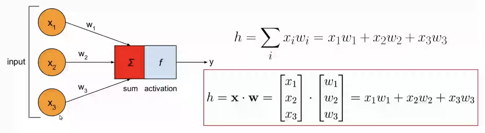
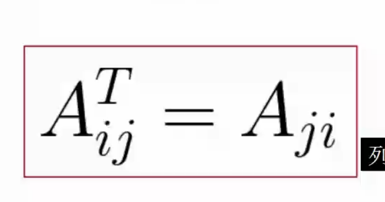

# 向量和矩阵运算 #

## 向量（vector） ##
一组数列 array of numbers
$$ 
\vec{a} = [ a_1 , a_2 , a_3] = \begin{bmatrix}
    a_1 \\ a_2 \\ a_3
\end{bmatrix}
$$

#### 向量和标量的运算 ####
$$ 
\vec{a} +n = \begin{bmatrix}
    a_1 \\ a_2 \\ a_3
\end{bmatrix} +n = \begin{bmatrix}
    a_1+n \\ a_2+n \\ a_3+n
\end{bmatrix}
$$

#### 向量和向量运算 ####
$$
\vec{a} +\vec{b} = \begin{bmatrix}
    a_1 \\ a_2 \\ a_3
\end{bmatrix} +\begin{bmatrix}
    b_1 \\ b_2 \\ b_3
\end{bmatrix} = \begin{bmatrix}
    a_1+b_1 \\ a_2+b_2 \\ a_3+b_3
\end{bmatrix}
$$
必须相同维度（项目数）

#### 点乘 ####
点乘也是内积
$$
\vec{a} ·\vec{b} = \begin{bmatrix}
    a_1 \\ a_2 \\ a_3
\end{bmatrix}·\begin{bmatrix}
    b_1 \\ b_2 \\ b_3
\end{bmatrix} = a_1·b_1+a_2·b_2+a_3·b_3
$$

内积——》最直接的例子就是直接用在上一节的人工神经元

## 矩阵（matrices） ##
$$
\vec{A_{i,j}} = \begin{bmatrix}
    a_{1,1} & a_{1,2}\\ a_{2,1} & a_{2,2}\\ a_{3,1} & a_{3,2}
\end{bmatrix}
$$

行向量、列向量、转制T

矩阵乘标量：每个位置乘
矩阵加矩阵：对位相加
矩阵乘矩阵：第一个列=第二个行