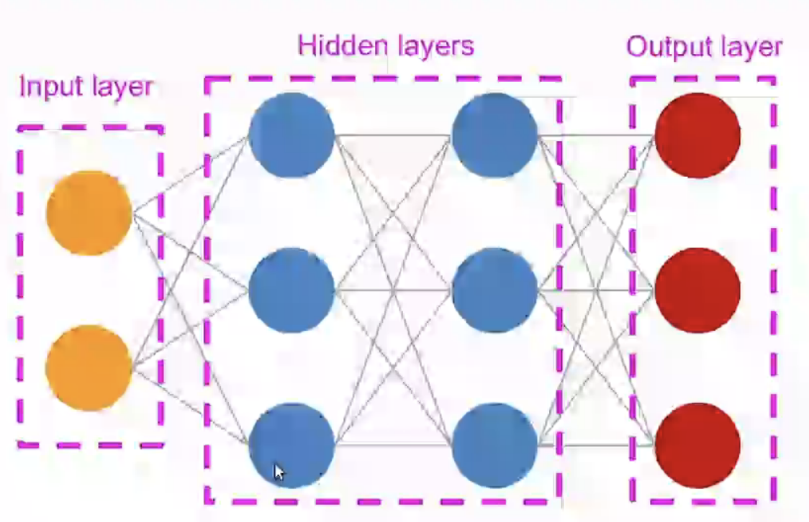
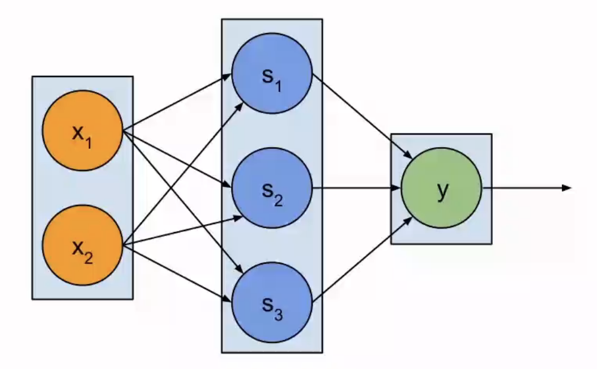
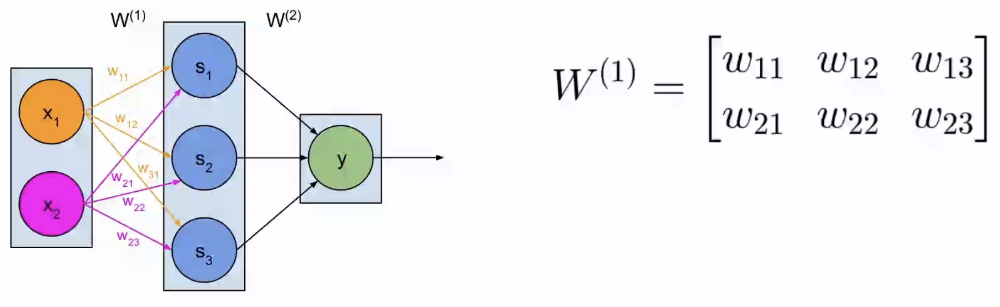
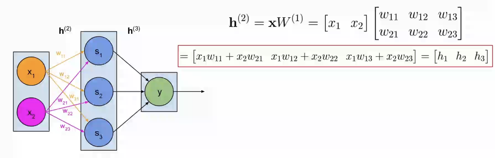
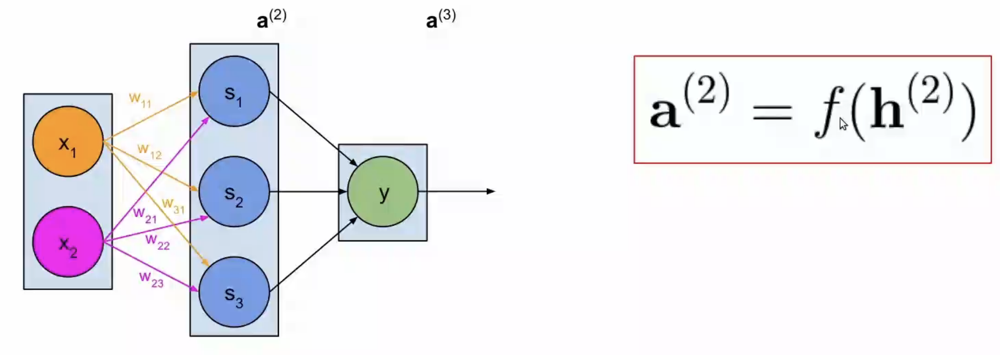

# 神经网络中的运算 #
为什么需要神经网络？
- 单独的神经元适合处理线性问题
- 现实问题很多都是非线性的复杂问题
- ANNs（人工神经网络）可以处理高度非线性函数问题

### 一个ANN的组成部分 ###
1. 神经元
2. 输入层、隐藏层、输出层
3. 加权连接
4. 激活函数（ activation function）

#### the multilayer perceptron（MLP）（多层感知器） ####

前馈网络、从左到右的信息处理层

1. 权重
2. 净输入net inputs（sum of weighted inputs）
3. 激活函数 Activation（输出至下一层）
  
  **权重矩阵**

**净输入**

**激活函数**

