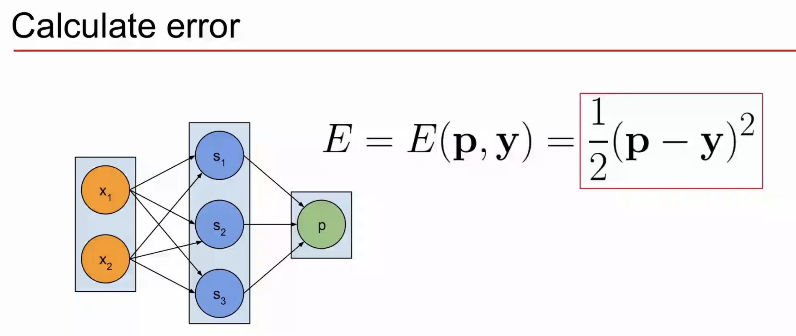

# 训练神经网络 #
1. tweak weights of the connections
2. Feed training data(input + target) to the network
3. Iterative adjustments

- 前向传播和反向传播

前向就是进行预测，根据输入得到一个输出y
根据输出计算与预期的误差

反向传播根据误差，计算下降梯度调整权重
更新参数

- 计算误差

$$
E = E(\vec{p},\vec{y}) = \frac{1}{2}(\vec{p}-\vec{y})^2
$$

- 计算误差公式的导数

链式公式，求出后式子，再接着算前一层的（反向传播）

对于输入$x$
$$
F = F(x,W)
$$
而误差公式 $E$
$$
E = E(p,y) = E(F(x,W),y)
$$
其中的预测$p$可以用输出代替

因此求导公式可以重写得出：
$$
\frac{\partial{E}}{\partial{W^{(2)}}}=\frac{\partial{E}}{\partial{a^{(3)}}}\frac{\partial{a^{(3)}}}{\partial{h^{(3)}}}\frac{\partial{h^{(3)}}}{\partial{W^{(2)}}}
$$

- 对于第一项：
$$
 E = 0.5(a^{(3)}-y)^2\\
\frac{\partial{E}}{\partial{a^{(3)}}} = 2·(0.5(a^{(3)}-y))·1 = a^{(3)}-y
$$
（复合函数求导）

- 对于第二项：
$$
a^{(3)} =  \frac{1}{1+e^{-h^{(3)}}}\\
\frac{\partial{a^{(3)}}}{\partial{h^{(3)}}} = \sigma'(h^{(3)}) = \sigma(h^{(3)})(1-\sigma(h^{(3)}))
$$

- 对于第三项：
$$
h^{(3)} = a^{(2)}W^{(2)}\\
\frac{\partial{h^{(3)}}}{\partial{W^{(2)}}} = a^{(2)}
$$

- 因此合并之后：
$$
\frac{\partial{E}}{\partial{W^{(2)}}}= (a^{(3)}-y)·\sigma'(h^{(3)})·a^{(2)}
$$

- 同样计算之前一层的导数W1
$$
\frac{\partial{E}}{\partial{W^{(1)}}}= \frac{\partial{E}}{\partial{a^{(2)}}}\frac{\partial{a^{(2)}}}{\partial{h^{(2)}}}\frac{\partial{h^{(2)}}}{\partial{W^{(1)}}}
$$

与此同时，对于第一项：
$$
\frac{\partial{E}}{\partial{a^{(2)}}} = \frac{\partial{E}}{\partial{a^{(3)}}}\frac{\partial{a^{(3)}}}{\partial{h^{(3)}}}\frac{\partial{h^{(3)}}}{\partial{a^{(2)}}}\\
\frac{\partial{E}}{\partial{W^{(1)}}}=\frac{\partial{E}}{\partial{a^{(3)}}}\frac{\partial{a^{(3)}}}{\partial{h^{(3)}}}\frac{\partial{h^{(3)}}}{\partial{a^{(2)}}}\frac{\partial{a^{(2)}}}{\partial{h^{(2)}}}\frac{\partial{h^{(2)}}}{\partial{W^{(1)}}}
$$

五项中前两项都已经在之前的计算中算过
只要计算后三项

对于第三项：
$$
\frac{\partial{h^{(3)}}}{\partial{a^{(2)}}} = W^{(2)}
$$
同样对于第四项：
$$
\frac{\partial{a^{(2)}}}{\partial{h^{(2)}}} = \sigma'(h^{(2)})= \sigma(h^{(2)})(1-\sigma(h^{(2)}))
$$

最后第五项：
$$
h^{(2)} = xW^{(1)}\\
\frac{\partial{h^{(2)}}}{\partial{W^{(1)}}} = x
$$

## 梯度下降 ##

